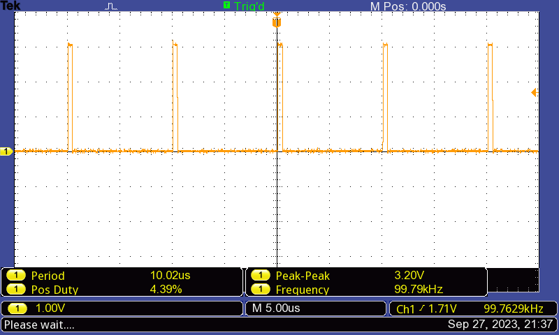

# Embedded Systems Lab Report

<!-- Insert your details here -->
* Daniel Dsa [ee23dp003@iitdh.ac.in] 
* Pradeep Kumar [222021006@iitdh.ac.in]
* Group: 10  
* [02-10-2023]

### Problem Statement:

Part 1:

Create a PWM waveform with frequency = 100KHz and variable duty cycle.

The program should begin with d = 50%.

On pressing one switch the duty should be increased by 5% and on pressing other switch it should be decreased by 5%.

### Solution Summary:

* The PWM frequency, period and start duty cycle are defined as constants.
* The GPIO_Init() and PWM_Init() functions are called in the main program to initialise GPIO (for switches) and PWM (for pin PF2).
* A while loop waits indefinitely until a GPIO interrupt occurs due to switch press.
* In the GPIOF_Handler() function, depending on which switch press caused the interrupt, the duty value is increased by 5% (SW1), or decreased by 5% (SW2). 
* PWM compare register value is updated  with the new duty value to update the duty cycle and GPIO interrupt flag is cleared.
.

 

### Assumptions, Constraints and Requirements:

* Assumption: Switch debounce is not considered since interrupts are used and polling method is not used.
#### Requirements: 
* The initial duty cycle is set as 50 and loaded into the Duty variable.
* The PWM is generated on pin PF2 (Blue LED) and LED brightness varies with PWM duty change.
* The PWM is initialied in down count mode where the output is high at the start of the period and low when the counter matches comparator A.
* Compare register is loaded with the updated duty values in the GPIOF_Handler.
* If switch SW1 is pressed, duty is increased by 5, this increases CMPA value and decreases duty cycle.
* If switch SW2 is pressed, duty is decreased by 5, this decreases CMPA value and increases duty cycle.

 

### Block diagram / Flowchart:

Start --> Define the PWM the PWM Frequency, PWM Period and PWM Start Duty. Initialise the current Duty as the PWM Start Duty.  -->  In the main() program, call the GPIO and PWM initialization functions.  --> The GPIO initialization function configures PF0 (SW2) and PF4 pins (SW1) to function as GPIO inputs. Interrupts with falling edge detect are enabled on PF0 and PF4. -->  The PWM initialization function  configures pin PF2 (blue LED) as the PWM pin. The Module 1 PWM generator 3 is configured to create a 100KHz PWM waveform. The counter of this PWM generator is configured to operate in down counting mode.  -->  Wait indefinitely in the main program using while(1) loop till the GPIO interrupt occurs. -->  In The GPIOF_Handler function, check which switch has caused the interrupt by checking status of Raw Interrupt Status Register. -->  If SW1 caused the interrupt, check if duty cycle is less than maximum duty cylcle of 95% -->  If yes, increase duty by 5. This increases CMPA value and decreases duty cycle. Clear the PF4 interrupt. If SW1 did not cause the interrupt, do nothing.  -->  If SW2 caused the interrupt, check if duty cycle is greater than minimum duty cylcle of 5% -->  If yes, decrease duty by 5. This decreases CMPA value and increases the duty cycle. Clear the PF0 interrupt. If SW2 did not cause the interrupt, do nothing. -->  Return to the while(1) loop and wait till the GPIO interrupt occurrs again.
 

### Measurements and Results:

* Oscilloscope waveforms for Initial, Maximum and Minimum duty cycle variation with switch press are shown. 
* The variation in duty cycle when SW1 / SW2 is pressed 4 times from initial duty cycle of 50% at start is also shown. 

### Discussion and Conclusions:

* A PWM waveform with frequency = 100KHz and variable duty cycle has been generated on pin PF2. As the PWM duty varies, the brightness of the BLUE LED varies.

The program begins with an initial duty cycle = 50%.

* On pressing switch (SW1)the duty cycle is decreased by 5% and on pressing other switch (SW2) duty cycle is increased by 5%.
