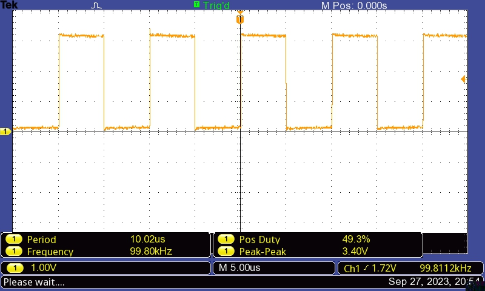
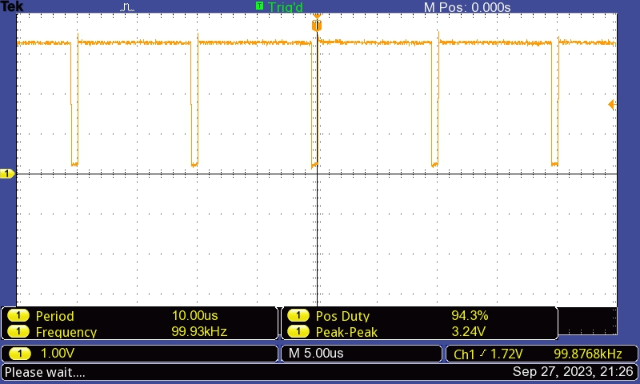
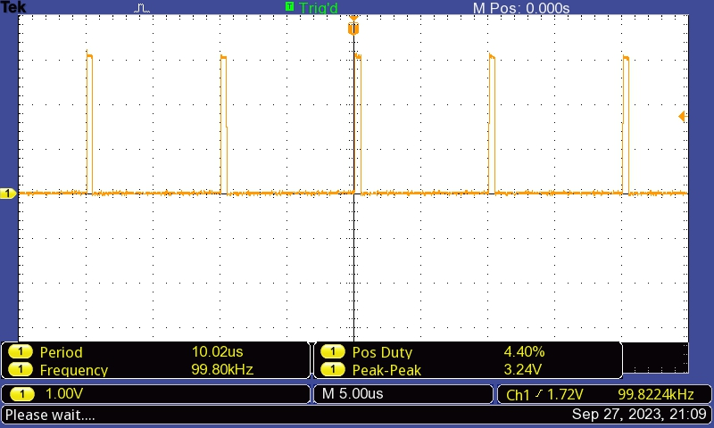
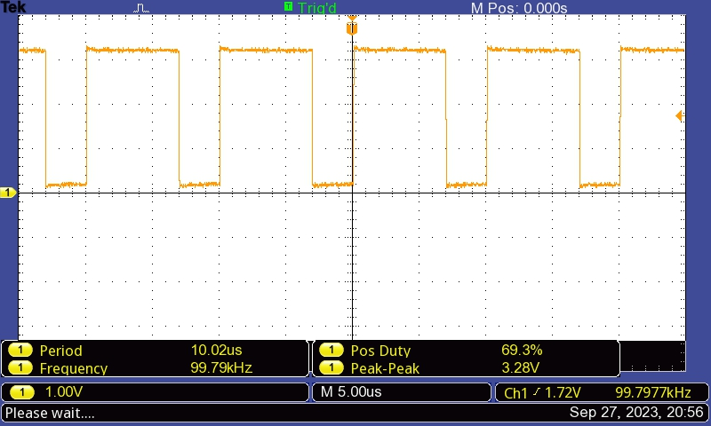
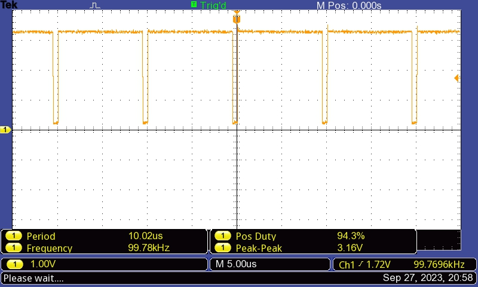

# Embedded Systems Lab Report

<!-- Insert your details here -->
* Daniel Dsa [ee23dp003@iitdh.ac.in] 
* Pradeep Kumar [222021006@iitdh.ac.in]
* Group: 10  
* [02-10-2023]

### Problem Statement:

Part 2:

Create a PWM waveform with frequency = 100KHz and variable duty cycle.

The program should begin with d = 50%.

Implement using only 1 switch (SW1 OR SW2) – short press for d increase and long press for decrease.

### Solution Summary:

* The PWM frequency, period and start duty cycle are defined as constants.
* The GPIO_Init() and PWM_Init() functions are called in the main program to initialise GPIO (for switch PF4) and PWM (for pin PF2).
* A while loop waits indefinitely until a GPIO interrupt occurs due to switch press.
* In the GPIOF_Handler() function, the SysTick timer is initialised for a value of 1 second.
* When the SysTick timer expires after one second, a SysTick interrupt occurs. 
* In the Systick_Handler() it is checked if SW1 is still pressed. 
  If yes, it implies a long press of SW1 and the duty value is increased by 5%
  If no, it implies a short press of SW1 and the duty value is decreased by 5%. 
* PWM compare register value is updated  with the new duty value to update the duty cycle and GPIO interrupt flag is cleared.

 

### Assumptions, Constraints and Requirements:

* Assumption: Switch debounce is not considered since interrupts are used and polling method is not used.
#### Requirements: 
* The initial duty cycle is set as 50 and loaded into the Duty variable.
* The PWM is generated on pin PF2 (Blue LED) and LED brightness varies with PWM duty change.
* The PWM is initialied in down count mode where the output is high at the start of the period and low when the counter matches comparator A.
* Compare register is loaded with the updated duty values in the GPIOF_Handler.
* If switch SW1 is long pressed (more than one second), duty is increased by 5, this increases CMPA value and decreases duty cycle.
* If switch SW1 is short pressed (less than one second), duty is decreased by 5, this decreases CMPA value and increases duty cycle.

### Block diagram / Flowchart:

Start --> Define the PWM the PWM Frequency, PWM Period and PWM Start Duty. Initialise the current Duty as the PWM Start Duty.  -->  In the main() program, call the GPIO and PWM initialization functions.  --> The GPIO initialization function configures PF4 pin (SW1) to function as GPIO input. Interrupt with falling edge detect are enabled on PF4. -->  The PWM initialization function  configures pin PF2 (blue LED) as the PWM pin. The Module 1 PWM generator 3 is configured to create a 100KHz PWM waveform. The counter of this PWM generator is configured to operate in down counting mode.  -->  Wait indefinitely in the main program using while(1) loop till the GPIO interrupt occurs. -->  In The GPIOF_Handler function, mask further interrupts from PF4 and initialize the SysTick timer for 1 second down count. -->  In the Systick Handler function, disable the SysTick Timer, Check if SW1 caused is still pressed --> If still pressed it implies long press, check if duty cycle is less than maximum duty cylcle of 95% -->  If yes, increase duty by 5. This increases CMPA value and decreases duty cycle. If SW1 not pressed it implies short press, check if duty cycle is greater than minimum duty cylcle of 5% -->  If yes, decrease duty by 5. This decreases CMPA value and increases the duty cycle. --> Clear the PF4 interrupt and unmask (enable) interrupts from PF4 -->  Return to the while(1) loop and wait till the GPIO interrupt occurrs again.

### Measurements and Results:

* Oscilloscope waveforms for Initial, Maximum and Minimum duty cycle variation with switch press(SW1) are shown. 
* The variation in duty cycle when SW1 is short pressed 4 times and 9 times from initial duty cycle of 50% at start is also shown. 

### Discussion and Conclusions:

* A PWM waveform with frequency = 100KHz and variable duty cycle has been generated on pin PF2. As the PWM duty varies, the brightness of the BLUE LED varies.

The program begins with an initial duty cycle = 50%.

* On short pressing switch SW1 the duty cycle is increased by 5% and on long pressing switch SW1 duty cycle is decreased by 5%.
