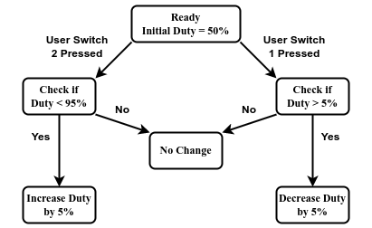
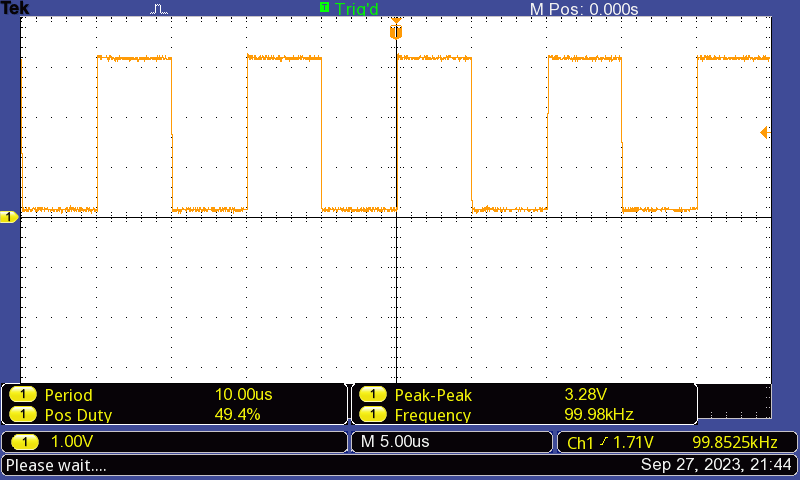
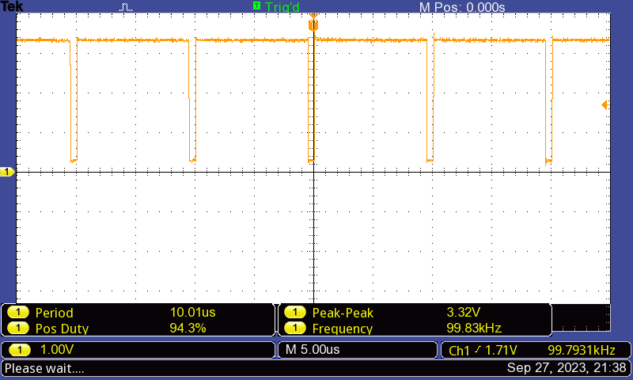
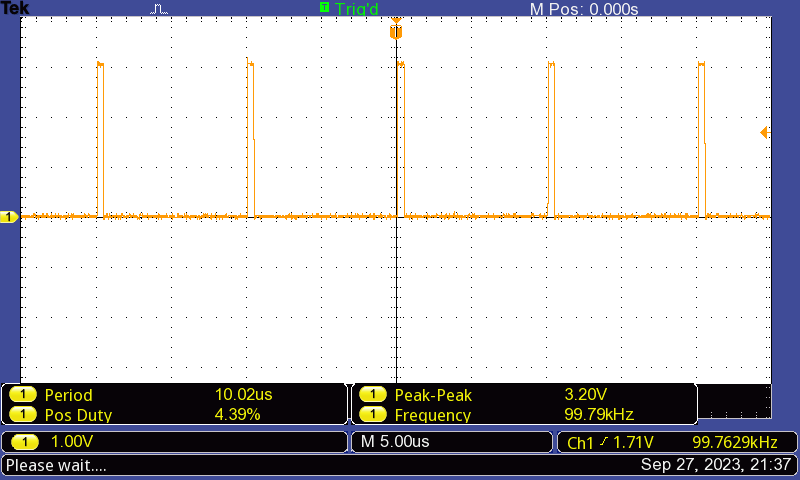
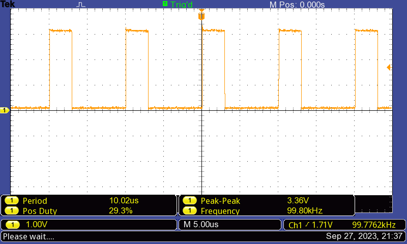
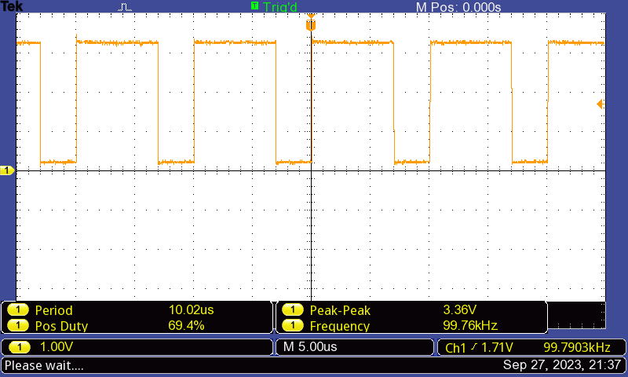

# Lab 7: PWM Generation with real time varying duty cycle

Group 10: EE23DP003 Daniel Dsa; 222021006 Pradeep Kumar M

## Problem Statement:

To Generate PWM signals which can be varied using user switches.
The programs to be implemented is as follows:
Part 1: Create a PWM signal with a frequency of 100KHz and initial duty cycle of 50%. On pressing one user switch, the duty cycle should increase by 5%, and on pressing the other, the duty cycle should decrease by 5%.

## Solution Summary:

* The PWM frequency, period and start duty cycle are defined as constants.
* The GPIO_Init() and PWM_Init() functions are called in the main program to initialise GPIO (for switches) and PWM (for pin PF2).
* A while loop waits indefinitely until a GPIO interrupt occurs due to switch press.
* In the GPIOF_Handler() function, depending on which switch press caused the interrupt, the duty value is increased by 5% (SW1), or decreased by 5% (SW2). 
* PWM compare register value is updated  with the new duty value to update the duty cycle and GPIO interrupt flag is cleared.

 
## Assumptions, Constraints and Requirements:

* Assumption: Switch debounce is not considered since interrupts are used and polling method is not used.
#### Requirements: 
* The initial duty cycle is set as 50 and loaded into the Duty variable.
* The PWM is generated on pin PF2 (Blue LED) and LED brightness varies with PWM duty change.
* The PWM is initialized in down count mode where the output is high at the start of the period and low when the counter matches comparator A.
* Compare register is loaded with the updated duty values in the GPIOF_Handler.
* If switch SW1 is pressed, duty is increased by 5, this increases CMPA value and decreases duty cycle.
* If switch SW2 is pressed, duty is decreased by 5, this decreases CMPA value and increases duty cycle.
* Duty cycle range is limited between 5% and 95%.

 

## Block diagram / Flowchart:

*State Diagram of duty cycle increment / decrement by 5% using two onboard switches*

Start --> Define the PWM the PWM Frequency, PWM Period and PWM Start Duty. Initialise the current Duty as the PWM Start Duty.  -->  In the main() program, call the GPIO and PWM initialization functions.  --> The GPIO initialization function configures PF0 (SW2) and PF4 pins (SW1) to function as GPIO inputs. Interrupts with falling edge detect are enabled on PF0 and PF4. -->  The PWM initialization function  configures pin PF2 (blue LED) as the PWM pin. The Module 1 PWM generator 3 is configured to create a 100KHz PWM waveform. The counter of this PWM generator is configured to operate in down counting mode.  -->  Wait indefinitely in the main program using while(1) loop till the GPIO interrupt occurs. -->  In The GPIOF_Handler function, check which switch has caused the interrupt by checking status of Raw Interrupt Status Register. -->  If SW1 caused the interrupt, check if duty cycle is less than maximum duty cylcle of 95% -->  If yes, increase duty by 5. This increases CMPA value and decreases duty cycle. Clear the PF4 interrupt. If SW1 did not cause the interrupt, do nothing.  -->  If SW2 caused the interrupt, check if duty cycle is greater than minimum duty cylcle of 5% -->  If yes, decrease duty by 5. This decreases CMPA value and increases the duty cycle. Clear the PF0 interrupt. If SW2 did not cause the interrupt, do nothing. -->  Return to the while(1) loop and wait till the GPIO interrupt occurrs again.
 
## Code:

/* Lab7 Part1:  PWM Waveform 100KHz with variable duty cycle on pin PF2 (Blue LED)
Initial duty cycle=50%, SW1 increases duty cycle by 5%, SW2 decreases duty cycle by 5% */

#include <stdint.h>
#include "tm4c123gh6pm.h"

#define PWM_FREQ 100000                      // 100 KHz PWM Frequency
#define PWM_PERIOD (16000000 / PWM_FREQ)    // PWM Period = 160
#define PWM_START_DUTY 50                  // Start duty cycle

volatile uint32_t Duty = PWM_START_DUTY;  // Initialize duty cycle to 50

void GPIO_Init(void);   // GPIO Init function declaration
void PWM_Init(void);   // PWM Init function declaration

int main(void)
{

    GPIO_Init();  //Initialize GPIO for pin PF0, PF4
    PWM_Init();   //Initialize PWM for pin PF0, PF4

    while (1)
    {
        //wait indefinitely
    }
}

void GPIO_Init(void)
{
    SYSCTL_RCGCGPIO_R |= SYSCTL_RCGCGPIO_R5;            // Enable GPIO Port F (for SW1 and SW2)
    while ((SYSCTL_PRGPIO_R & SYSCTL_PRGPIO_R5) == 0); // Wait for GPIO PortF peripheral to be ready

    // Configure SW1 (PF4) and SW2 (PF0) as inputs
    GPIO_PORTF_LOCK_R = GPIO_LOCK_KEY; // Unlock GPIO PortF
    GPIO_PORTF_CR_R = 0x01;           // Uncommit and Allow changes to PF0 (SW2)
    GPIO_PORTF_DIR_R &= ~(0x11);     // Direction: bits 0 and 4 set as inputs
    GPIO_PORTF_DEN_R |= 0x11;       // Digital Enable: bits 0 and 4
    GPIO_PORTF_PUR_R |= 0x11;      // Pull-up resistors enabled on PF0 AND PF4

    // Configure GPIO interrupt for Port F (Switches)
    GPIO_PORTF_IS_R &= ~0x11;     // Interrupt Sense: Edge-sensitive
    GPIO_PORTF_IBE_R &= ~0x11;   // Interrupt Both Edges: Not both edges
    GPIO_PORTF_IEV_R &= ~0x11;  // Interrupt Event: Falling edge event
    GPIO_PORTF_ICR_R |= 0x11;  // Interrupt Clear: Clear the interrupt flags for PF0 , PF4
    GPIO_PORTF_IM_R |= 0x11;  // Interrupt Mask: Unmask (Enable) interrupt on PF0 , PF4
    NVIC_EN0_R |= 1 << 30;   // Interrupt Enable: Enable interrupt for GPIO PF0 (bit 30)
}

void PWM_Init(void)
{
    SYSCTL_RCGCPWM_R |= SYSCTL_RCGCPWM_R1;            // Enable the PWM1 module
    while ((SYSCTL_PRPWM_R & SYSCTL_PRPWM_R1) == 0); // Wait for PWM1 module to be ready

    //Configure PF2 (M1PWM6) as PWM Output
    GPIO_PORTF_AFSEL_R |= 0x04;          // Enable alternate function on PF2
    GPIO_PORTF_PCTL_R &= ~0x00000F00;   // Port Control: Clear PF2
    GPIO_PORTF_PCTL_R |= 0x00000500;   // Port Control: Configure PF2 as M1PWM6
    GPIO_PORTF_DIR_R |= 0x04;         // Direction: Make PF2 as output
    GPIO_PORTF_DEN_R |= 0x04;        // Digital enable PF2

    //Configure Module 1 PWM Generator 3 which controls Module 1 PWM6 (M1PWM6) on pin PF2
    PWM1_3_CTL_R = 0;             // Disable PWM while configuring
    PWM1_3_GENA_R = 0x0000008C;  /* Down Count: M1PWM6 output is high at the start of the period
                                   and low when the counter matches comparator A */
    PWM1_3_LOAD_R = PWM_PERIOD - 1;             // Set PWM period
    PWM1_3_CMPA_R = (PWM_PERIOD * Duty) / 100; // Set Compare A value, consider initial duty
    PWM1_3_CTL_R |= 0x00000001;               // Enable PWM1 Generator 3
    PWM1_ENABLE_R |= 0x00000040;             // Enable Module1 PWM6 (M1PWM6) output
}

void GPIOF_Handler(void)               // GPIO PortF Interrupt handler
{
    if ( GPIO_PORTF_RIS_R & 0x10)     // Raw Interrupt Status: Check for PF4 (SW1) interrupt
    {
        if (Duty < 95)               // Check if current duty cycle is less than max value 95
        {
            Duty += 5;              // Increase duty by 5, this increases CMPA value and decreases duty cycle
        }
        GPIO_PORTF_ICR_R = 0x10;   // Clear GPIO interrupt for PF4 (SW1)
    }
    if ( GPIO_PORTF_RIS_R & 0x01)  // Raw Interrupt Status: Check for PF0 (SW2) interrupt
    {
        if (Duty > 5)      // Check if current duty cycle is greater than min value 5%
        {
            Duty -= 5;    // Decrease duty by 5, this decreases CMPA value and increases duty cycle
        }
        GPIO_PORTF_ICR_R = 0x01; // Clear GPIO interrupt for PF0 (SW2)
    }

    PWM1_3_CMPA_R = (PWM_PERIOD * Duty) / 100; // Update PWM1 Generator 3 Compare A value
}

## Measurements and Results:

* Oscilloscope waveforms for Initial, Maximum and Minimum duty cycle variation with switch press are shown. 
* The variation in duty cycle when SW1 / SW2 is pressed 4 times from initial duty cycle of 50% at start is also shown. 

*PWM signal on PF2 with default duty cycle of 50%*

*PWM signal on PF2 with maximum duty cycle of 95%*

*PWM signal on PF2 with minimum duty cycle of 5%*

*PWM signal on PF2 with SW1 pressed 4 times starting from initial duty of 50%*

*PWM signal on PF2 with SW2 pressed 4 times starting from initial duty of 50%*

## Discussion and Conclusions:

* A PWM waveform with frequency = 100KHz and variable duty cycle has been generated on pin PF2. As the PWM duty varies, the brightness of the BLUE LED varies. The program begins with an initial duty cycle = 50%.

* On pressing switch (SW1) the duty cycle is decreased by 5% and on pressing switch (SW2) duty cycle is increased by 5%.
