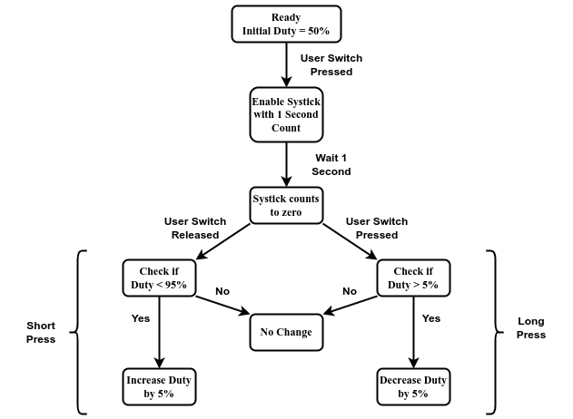
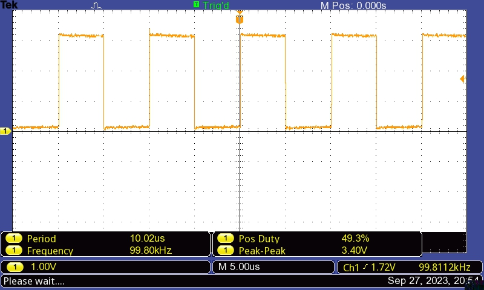
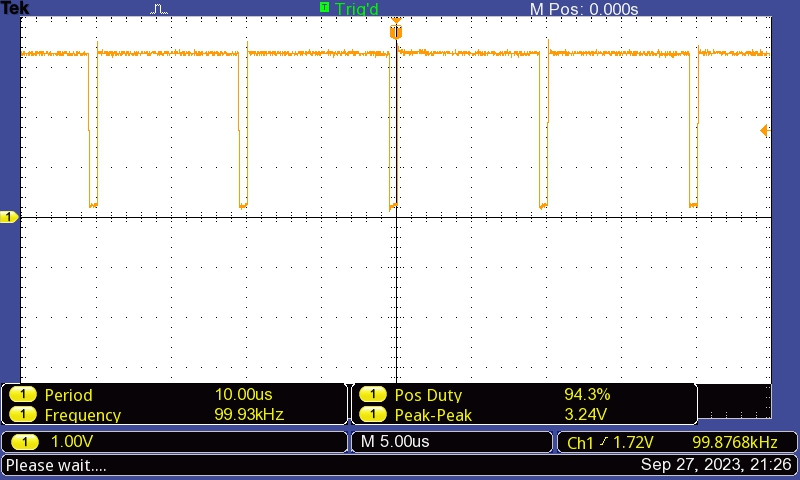
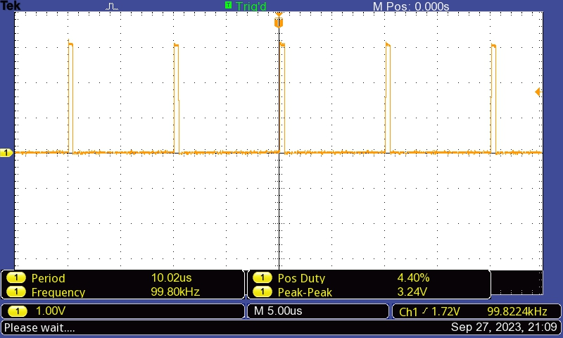
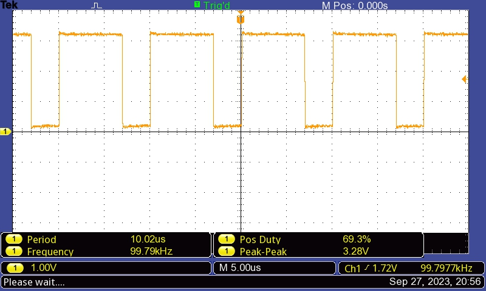

# Lab 7: PWM Generation with varying duty cycle using single switch

Group 10: EE23DP003 Daniel Dsa; 222021006 Pradeep Kumar M

## Problem Statement:

To Generate PWM signals which can be varied using single user switch.
The programs to be implemented is as follows:

Lab 7 Part 2:

Create a PWM waveform with frequency = 100KHz and variable duty cycle.

The program should begin with d = 50%.

Implement using only 1 switch (SW1 OR SW2) – short press for d increase and long press for decrease.

## Solution Summary:

* The PWM frequency, period and start duty cycle are defined as constants.
* The GPIO_Init() and PWM_Init() functions are called in the main program to initialise GPIO (for switch PF4) and PWM (for pin PF2).
* A while loop waits indefinitely until a GPIO interrupt occurs due to switch press.
* In the GPIOF_Handler() function, the SysTick timer is initialised for a value of 1 second.
* When the SysTick timer expires after one second, a SysTick interrupt occurs. 
* In the Systick_Handler() it is checked if SW1 is still pressed. 
  If yes, it implies a long press of SW1 and the duty value is increased by 5%
  If no, it implies a short press of SW1 and the duty value is decreased by 5%. 
* PWM compare register value is updated  with the new duty value to update the duty cycle and GPIO interrupt flag is cleared.

 
## Assumptions, Constraints and Requirements:

* Assumption: Switch debounce is not considered since interrupts are used and polling method is not used.
#### Requirements: 
* The initial duty cycle is set as 50 and loaded into the Duty variable.
* The PWM is generated on pin PF2 (Blue LED) and LED brightness varies with PWM duty change.
* The PWM is initialied in down count mode where the output is high at the start of the period and low when the counter matches comparator A.
* Compare register is loaded with the updated duty values in the GPIOF_Handler.
* If switch SW1 is long pressed (more than one second), duty is increased by 5, this increases CMPA value and decreases duty cycle.
* If switch SW1 is short pressed (less than one second), duty is decreased by 5, this decreases CMPA value and increases duty cycle.
* Duty cycle range is limited between 5% and 95%.

 

## Block diagram / Flowchart:

*State Diagram of duty cycle increment / decrement by 5% using single switch SW1*

Start --> Define the PWM the PWM Frequency, PWM Period and PWM Start Duty. Initialise the current Duty as the PWM Start Duty.  -->  In the main() program, call the GPIO and PWM initialization functions.  --> The GPIO initialization function configures PF4 pin (SW1) to function as GPIO input. Interrupt with falling edge detect are enabled on PF4. -->  The PWM initialization function  configures pin PF2 (blue LED) as the PWM pin. The Module 1 PWM generator 3 is configured to create a 100KHz PWM waveform. The counter of this PWM generator is configured to operate in down counting mode.  -->  Wait indefinitely in the main program using while(1) loop till the GPIO interrupt occurs. -->  In The GPIOF_Handler function, mask further interrupts from PF4 and initialize the SysTick timer for 1 second down count. -->  In the Systick Handler function, disable the SysTick Timer, Check if SW1 caused is still pressed --> If still pressed it implies long press, check if duty cycle is less than maximum duty cylcle of 95% -->  If yes, increase duty by 5. This increases CMPA value and decreases duty cycle. If SW1 not pressed it implies short press, check if duty cycle is greater than minimum duty cylcle of 5% -->  If yes, decrease duty by 5. This decreases CMPA value and increases the duty cycle. --> Clear the PF4 interrupt and unmask (enable) interrupts from PF4 -->  Return to the while(1) loop and wait till the GPIO interrupt occurrs again.

## Code:

/* Lab 7 Part 2:  PWM Waveform 100KHz with variable duty cycle on pin PF2 (Blue LED)
Initial duty cycle=50%, SW1: short press increases duty cycle by 5%, long press decreases duty by 5% */

#include <stdint.h>
#include "tm4c123gh6pm.h"

#define PWM_FREQ 100000                     // 100 KHz PWM Frequency
#define PWM_PERIOD (16000000 / PWM_FREQ)    // PWM Period = 160
#define PWM_START_DUTY 50                  // Start duty cycle

//Definitions for SysTick CSR (Control and Status Register)
#define ENABLE (1 << 0) // CSR bit 0 to enable the SysTick timer
#define INT_EN (1<<1) // CSR bit 1 to generate interrupt to NVIC when Systick reaches 0
#define CLK_SRC (1<<2) // CSR bit 2 to take system clock
#define COUNT_FLAG (1<<16)  // CSR bit 16,  1 -> SysTick counted to zero

volatile uint32_t Duty = PWM_START_DUTY;  // Initialize current duty cycle to 50

void GPIO_Init(void);   // GPIO Init function declaration
void PWM_Init(void);   // PWM Init function declaration

void main(void)
{

    GPIO_Init();  //Initialise GPIO for pin PF4
    PWM_Init();   //Initialise PWM for pin PF4

    while (1)
    {
        //wait indefinitely
    }
}

void GPIO_Init(void)
{
    SYSCTL_RCGCGPIO_R |= SYSCTL_RCGCGPIO_R5;            // Enable GPIO Port F (for SW1)
    while ((SYSCTL_PRGPIO_R & SYSCTL_PRGPIO_R5) == 0); // Wait for GPIO PortF peripheral to be ready

    // Configure SW1 (PF4) as input
    GPIO_PORTF_LOCK_R = GPIO_LOCK_KEY; // Unlock GPIO PortF
    GPIO_PORTF_CR_R = 0x01;           // Uncommit and Allow changes to PF0 (SW2 not used)
    GPIO_PORTF_DIR_R &= ~(0x10);     // Direction: PF4 as input
    GPIO_PORTF_DEN_R |= 0x10;       // Digital Enable: bit 4
    GPIO_PORTF_PUR_R |= 0x10;      // Pull-up resistor enabled on PF4

    // Configure GPIO interrupt for Port F (Switch) PF0
    GPIO_PORTF_IS_R &= ~0x10;     // Interrupt Sense: Edge-sensitive
    GPIO_PORTF_IBE_R &= ~0x10;   // Interrupt Both Edges: Not both edges
    GPIO_PORTF_IEV_R &= ~0x10;  // Interrupt Event: Falling edge event
    GPIO_PORTF_ICR_R |= 0x10;  // Interrupt Clear: Clear the interrupt flags for PF0 , PF4
    GPIO_PORTF_IM_R |= 0x10;  // Interrupt Mask: Unmask (Enable) interrupt on PF0 , PF4
    NVIC_EN0_R |= 1 << 30;   // Interrupt Enable: Enable interrupt for GPIO PF0 (bit 30)
}

void PWM_Init(void)
{
    SYSCTL_RCGCPWM_R |= SYSCTL_RCGCPWM_R1;            // Enable the PWM1 module
    while ((SYSCTL_PRPWM_R & SYSCTL_PRPWM_R1) == 0); // Wait for PWM1 module to be ready

    //Configure PF2 (M1PWM6) as PWM Output
    GPIO_PORTF_AFSEL_R |= 0x04;          // Enable alternate function on PF2
    GPIO_PORTF_PCTL_R &= ~0x00000F00;   // Port Control: Clear PF2
    GPIO_PORTF_PCTL_R |= 0x00000500;   // Port Control: Configure PF2 as M1PWM6
    GPIO_PORTF_DIR_R |= 0x04;         // Direction: Make PF2 as output
    GPIO_PORTF_DEN_R |= 0x04;        // Digital enable PF2

    //Configure Module 1 PWM Generator 3 which controls Module 1 PWM6 (M1PWM6) on pin PF2
    PWM1_3_CTL_R = 0;             // Disable PWM while configuring
    PWM1_3_GENA_R = 0x0000008C;  /* Down Count: M1PWM6 output is high at the start of the period
                                   and low when the counter matches comparator A */
    PWM1_3_LOAD_R = PWM_PERIOD - 1;             // Set PWM period
    PWM1_3_CMPA_R = (PWM_PERIOD * Duty) / 100; // Set Compare A value, consider initial duty
    PWM1_3_CTL_R |= 0x00000001;               // Enable PWM1 Generator 3
    PWM1_ENABLE_R |= 0x00000040;             // Enable Module1 PWM6 (M1PWM6) output
}

void SysTick_Init(void)
{
NVIC_ST_CURRENT_R = 0x00; // SysTick current value register cleared
NVIC_ST_RELOAD_R = 16000000; // Reload value when counter reaches 0 (1sec delay)
NVIC_ST_CTRL_R |= (ENABLE | INT_EN | CLK_SRC); // Enable Systick, Interrupt and use System clock
}

void GPIOF_Handler(void)
{
    GPIO_PORTF_IM_R &= ~0x10;     // Disable interrupt from PF4
    SysTick_Init();

}

void SysTick_Handler(void)
{
    NVIC_ST_CTRL_R = 0;  // Disable the SysTick timer
        if ( (GPIO_PORTF_DATA_R & (1<<4)) == 0 )   // Long Press: Check if switch SW1 still pressed after one sec
        {
            if (Duty < 95)      // Check if duty cycle is less than max value 95
                {
                    Duty += 5; // Increase duty by 5, this increases CMPA value and decreases duty cycle
                }

        }
        else                       // Short Press of SW1
        {
            if (Duty > 5)         // Check if duty cycle is greater than min value 5%
                {
                    Duty -= 5;    // Decrease duty by 5, this decreases CMPA value and increases duty cycle
                }
        }

    PWM1_3_CMPA_R = (PWM_PERIOD * Duty) / 100; // Update PWM1 Generator 3 Compare A value
    GPIO_PORTF_ICR_R |= 0x10; // Clear GPIO interrupt for PF4 (SW1)
    GPIO_PORTF_IM_R |= 0x10;  // Unmask (Enable) interrupts from PF4 (SW1)
}

## Measurements and Results:

* Oscilloscope waveforms for Initial, Maximum and Minimum duty cycle variation with switch press are shown. 

*PWM signal on PF2 with default duty cycle of 50%*

*PWM signal on PF2 with maximum duty cycle of 95% (SW1 short press 9 times from initial duty)*

*PWM signal on PF2 with minimum duty cycle of 5% (SW1 long press 9 times from initial duty)*

*PWM signal on PF2 with SW1 short pressed 4 times starting from initial duty of 50%*

## Discussion and Conclusions:

* A PWM waveform with frequency = 100KHz and variable duty cycle has been generated on pin PF2. As the PWM duty varies, the brightness of the BLUE LED varies. The program begins with an initial duty cycle = 50%.

* On long pressing switch (SW1) the duty cycle is decreased by 5% and on short pressing switch (SW2) duty cycle is increased by 5%.
