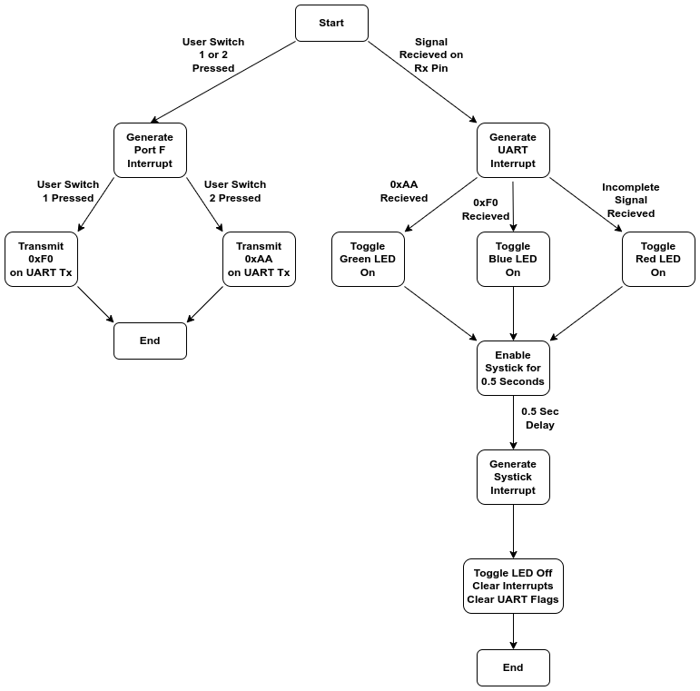
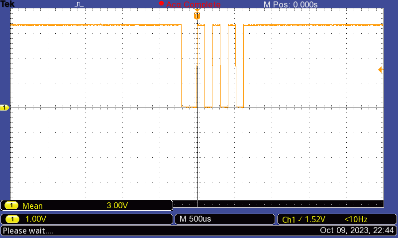
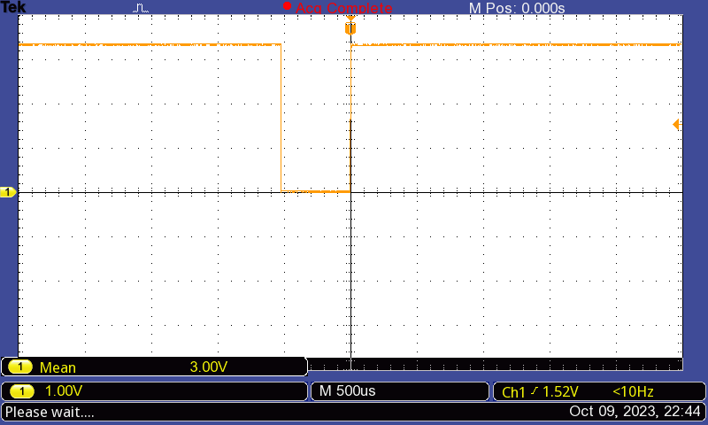
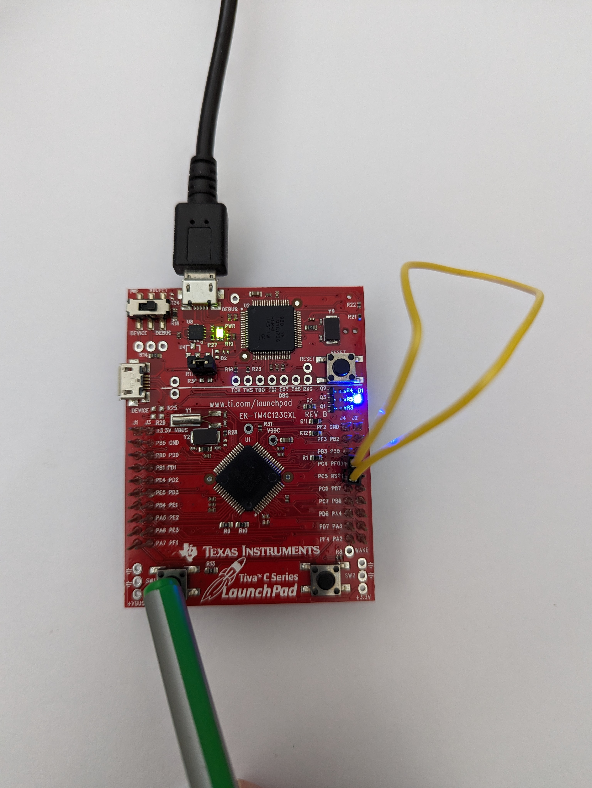
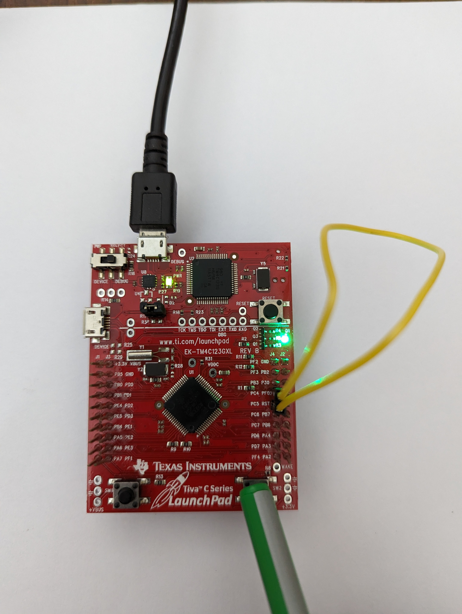
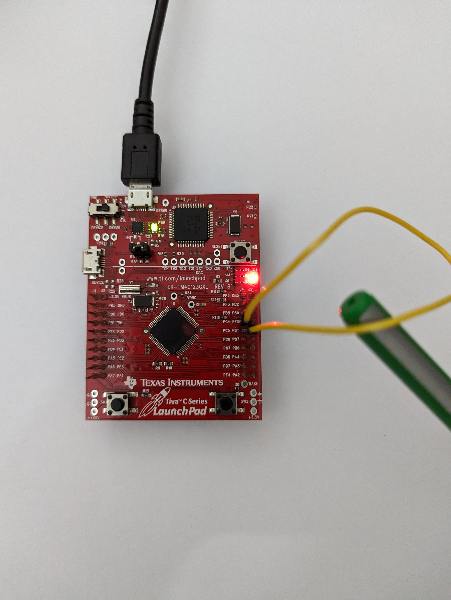

# Lab 8: UART implementation using TM4C123GH6PM microcontroller

Group 10: EE23DP003 Daniel Dsa; 222021006 Pradeep Kumar M

## Aim:
To implement UART based communication on the TM4C123GH6PM microcontroller and verify the same.
The program to be implemented is as follows:
* Configure the TM4C123GH6PM to enable UART communication at 9600 baud rate with odd parity.
* If user switch 1 is pressed, 0xAA should be transmitted.
* If user switch 2 is pressed, 0xF0 should be transmitted.
* If 0xAA is recieved, Green LED should turn ON.
* If 0xF0 is recieved, Blue LED should turn ON.
* If any error is detected, Red LED should turn ON.

## Procedure:
1. Port F is configured such that user switches SW1, SW2 are inputs and onboard LEDs are outputs.
2. Port C pins PC4 and PC5 are configured, such that PC4 is the Rx pin, PC5 is the Tx pin.
3. UART Module 4 registers are configured to generate the required baud rate and implement odd parity.  
4. Interrupts are enabled for user switches and UART receive. Interrupt priority levels are assigned.
5. Systick is initialised to keep LED on for desired duration before clearing GPIO and UART receive interrupts.

## UART Protocol on TM4C123GH6PM:

## Algorithm:
The algorithm for implementing UART data transmit and receive is shown in the stateflow diagram below:

*Stateflow diagram for UART data transmit and receive *

## Code:

/*
 * UART with baud rate 9600 and odd parity.
 * Transmit "F0" if SW1 is pressed
 * Transmit "AA" if SW2 is pressed
 * if "AA" is received LED should be GREEN;
 * if "F0" is recieved, the LED should be BLUE
 * if any error is detected LED should be RED
 *
 * Using PC4, PC5; UART Module 4
 * PC4 = U4Rx; PC5 = U4Tx
 */

#include <stdint.h>
#include <stdbool.h>
#include "tm4c123gh6pm.h"

#define Sw_Bits 0x11     // SW1 = PF4, SW2 = PF0
#define Sw1_Data 0xF0    // Data to transmit if SW1 is pressed
#define Sw2_Data 0xAA    // Data to transmit if SW2 is pressed

#define Red 0X02        // Red LED = PF1
#define Blue 0X04       // Blue LED = PF2
#define Green 0X08      // Green LED =PF3

//Definitions to configure systick CSR(Control and Status Register)
#define ENABLE (1<<0)       // bit 0 of CSR enables systick counter
#define INT_EN (1<<1)       // bit 1 of CSR to generate interrupt to the NVIC when SysTick counts to 0
#define Clk_SRC (1<<2)      // bit 2 of CSR to select system clock
#define COUNT_FLAG (1<<16)  // bit 16 of CSR; The SysTick timer has counted to 0 since the last time this bit was read.

void PortF_Config(void);   // GPIO Port F Configuration
void PortF_Handler(void);  // GPIO Port F Interrupt Handler
void UART_Config(void);    // UART Module 4 Configuration
void UART_Handler(void);   // UART Interrupt Handler
void Systick_Config(void); // Systick Configuration
void Systick_Handler(void); //Systick Interrupt Handler

void main(void)
{
    SYSCTL_RCGCUART_R |= (1<<4);  // Enable and provide a clock to UART module 4 in Run mode
    SYSCTL_RCGCGPIO_R |= (1<<5);    // Enable and provide a clock to GPIO Port F (LEDs)
    SYSCTL_RCGCGPIO_R |= (1<<2);   // Enable and provide a clock to GPIO Port C (UART4)

    UART_Config(); // Configure UART Module 4 for U4Rx (PC4) and U4Tx (PC5)
    PortF_Config(); // Configure PORTF for SW1, SW2 and LEDs

    while(1){}
}

void PortF_Config(void)
{
    GPIO_PORTF_LOCK_R = GPIO_LOCK_KEY;  // Unlock PortF register
    GPIO_PORTF_CR_R = 0x1F;             // Enable Commit function

    GPIO_PORTF_PUR_R = 0x11;            // Pull-up for user switches
    GPIO_PORTF_DEN_R = 0x1F;            // Enable all pins on port F
    GPIO_PORTF_DIR_R = 0x0E;            // PortF LEDs as output and switches as input

    // PortF Interrupt Configuration: User SW should trigger hardware interrupt
    GPIO_PORTF_IS_R &= ~Sw_Bits;        // Edge trigger detect
    GPIO_PORTF_IBE_R &= ~Sw_Bits;       // Trigger interrupt according to GPIOIEV
    GPIO_PORTF_IEV_R &= ~Sw_Bits;       // Trigger interrupt on falling edge
    GPIO_PORTF_IM_R &= ~Sw_Bits;        // Mask interrupt bits
    GPIO_PORTF_ICR_R |= Sw_Bits;        // Clear any prior interrupts
    GPIO_PORTF_IM_R |= Sw_Bits;         // Enable interrupts for bits corresponding to Sw_Bits

    // NVIC Configuration: PortF interrupts correspond to interrupt 30 (EN0 and PRI7 registers)
    NVIC_EN0_R |= (1<<30);              // Interrupts enabled for port F
    NVIC_PRI7_R &= 0xFF3FFFFF;          //Interrupt Priority 1 to Port F
}

void UART_Config(void)
{
    /*
    *BRDI = integer part of the BRD; BRDF = fractional part
    *BRD = BRDI + BRDF = UARTSysClk / (ClkDiv * Baud Rate)
    *UARTSysClk = 16MHz, ClkDiv = 16, Baud Rate = 9600
    *BRD = 104.167; BRDI = 104; BRDF = 167;
    *UARTFBRD[DIVFRAC] = integer(BRDF * 64 + 0.5) = 11
    */
    //UART4_CTL_R &= (0<<0);                    // Disable UART module 4
    UART4_IBRD_R = 104;                        // UART Integer Baud-Rate Divisor
    UART4_FBRD_R = 11;                        // UART Fractional Baud-Rate Divisor
    UART4_CC_R = 0x00;                       // UART Clock Configuration 0 -> System Clock
    UART4_LCRH_R = 0x62;                    // 8 bit word length, Parity Enable
    UART4_CTL_R |= ((1<<0)|(1<<8)|(1<<9)); // Enable UART module 4, Transmit and Receive

    // UART4 interrupt configuration
    UART4_IM_R &= ((0<<4)|(0<<5)|(0<<8));     // Mask Rx, Tx and Parity interrupts
    UART4_ICR_R |= ((1<<4)|(1<<5)|(1<<8));   // Clear Rx, Tx and Parity interrupts
    UART4_IM_R |= (1<<4);                   // Enable Rx interrupt
    // NVIC Configuration: UART4 interrupt corresponds to interrupt 60 (EN1 and PRI15 registers)
    NVIC_EN1_R |= (1<<28);                 // Interrupt enabled for UART4
    NVIC_PRI15_R &= 0x00000050;           // Interrupt Priority 2 to UART4

    GPIO_PORTC_LOCK_R = GPIO_LOCK_KEY;    // Unlock PortC register
    GPIO_PORTC_CR_R = 0xFF;              // Enable Commit function
    GPIO_PORTC_DEN_R = 0xFF;            // Enable all pins on port C
    GPIO_PORTC_DIR_R |= (1<<5);        // Define PC4 (Rx) as input, PC5 (Tx) as output
    GPIO_PORTC_AFSEL_R |= 0x30;       // Enable Alternate function for PC4 (Rx) and PC5 (Tx)
    GPIO_PORTC_PCTL_R |= 0x00110000; // Selecting UART function for PC4 and PC5
}

void Systick_Config(void)
{
NVIC_ST_RELOAD_R = 16*1000000/2;                 // Run Systick for 0.5 second
NVIC_ST_CURRENT_R = 0x00;                       // Initialize Systick Current value to zero
NVIC_ST_CTRL_R |= (ENABLE | INT_EN | Clk_SRC); // Enable Systick, Interrupt Generation, system clock
}

void PortF_Handler()
{
    GPIO_PORTF_IM_R &= ~Sw_Bits;         // Mask (Disable) Interrupts from PF4 and PF0

    if(GPIO_PORTF_RIS_R & 0x10)         // Raw Interrupt Status, Check if SW1 caused interrupt
    {
        UART4_DR_R = Sw1_Data;             // Transmit 0xF0 if interrupt due to SW1
    }
    else if (GPIO_PORTF_RIS_R & 0x01) // Raw Interrupt Status, Check if SW2 caused interrupt
    {
        UART4_DR_R = Sw2_Data;           // Transmit 0xAA if interrupt due to SW2
    }
}

void UART_Handler(void)
{
    UART4_IM_R &= (0<<4);         // Mask UART4 Rx interrupt

    if(UART4_FR_R & (1<<6))      // UART Flag Register, Check if  UART Receive FIFO full
    {
        if(UART4_DR_R == 0xAA)  // Check if data received by UART = 0xAA
        {
            GPIO_PORTF_DATA_R = Green; // Turn on Green LED if UART data received = 0xAA
        }
        else if(UART4_DR_R == 0xF0)   // Check if data received by UART = 0xF0
        {
            GPIO_PORTF_DATA_R = Blue;  // Turn on Blue LED if UART data received = 0xF0
        }
    }

    if(UART4_RSR_R & 0x0000000F)    // UART Receive Status Register, Check for error in UART data
    {
        GPIO_PORTF_DATA_R = Red;  // Turn on Red LED if error during UART data reception
    }

    UART4_ECR_R &= 0xFFFFFFF0;   // UART Error Clear Register, Clear UART4 errors

   Systick_Config();            // Initialise Systick timer for 0.5 second

}

void Systick_Handler(void)
{
    GPIO_PORTF_DATA_R &= 0x00;      // Turn off LED after 0.5 second
    GPIO_PORTF_ICR_R |= Sw_Bits;   // Clear any pending interrupts from SW1 and SW2
    GPIO_PORTF_IM_R |= Sw_Bits;   // Unmask (Enable) interrupts from SW1 and SW2
    UART4_IM_R |= (1<<4);        // Unmask (Enable) UART4 Rx interrupt
}

## Results:
The pins PC5 (U4Tx) and PC4 (U4Rx) are connected to each other to verify the UART data transmit and recieve operation. LED turn on for a fixed time period of 0.5 seconds using Systick depending on the data received in the UART receive interrupt is also verified.

The transmit logic performs parallel-to-serial conversion on the data read from the transmit FIFO. The control logic outputs the serial bit stream beginning with a start bit followed by the data bits (LSB first), parity bit, and the stop bits according to the programmed configuration in the control registers. This is verified as shown below:

 * 0xAA is transmitted from Tx pin (PC5) when switch SW1 is pressed, and captured on the oscilloscope.
 * 0xAA is 10101010 in binary
 * As the number of 1's in 10101010 is even, the parity bit should set to 1 to make the total number of 1's odd.
 * A single stop bit (1 / High) is sent along with the data.
 * The data is sent LSB first, hence 01010101 is sent.
 * Hence, the waveform to be observed would be 0_01010101_1_1 (StartBit_DataBits_ParityBit_StopBit)

 

*0xAA transmit / receive waveform captured on oscilloscope*

*0xF0 transmit / receive waveform captured on oscilloscope*

*Pressing user switch 1, Tx and Rx of 0xF0, and Blue LED turn on*

*Pressing user switch 2, Tx and Rx of 0xAA, and Green LED turn on*

*Receiving error signal, and Red LED turn on*
